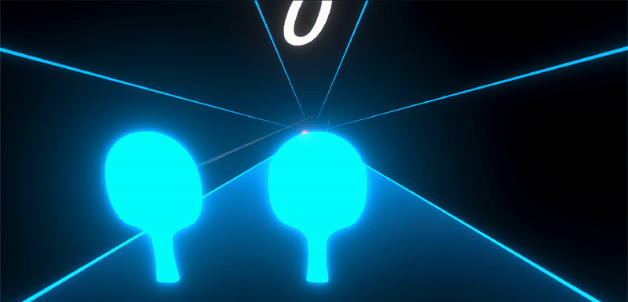
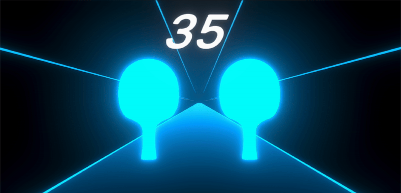

# VR Beat Tennis

VR Beat Tennis is a rhythm-based virtual reality game developed in Unity as the final project for the PROJECT IN COMPUTER GRAPHICS course.

## Game Overview

In VR Beat Tennis, players wield two virtual tennis rackets to hit balls that arrive in sync with the music. The twist? Each ball must be directed into a corresponding basket that appears alongside it, adding an extra layer of challenge and precision to the gameplay.

  

## Features

### Dynamic Gameplay
- Rhythmic ball-hitting synchronized with music
- Precision aiming to hit balls into matching baskets

### Level Editor
Our game includes a robust level editor that allows for customization and creation of new challenges:

- Compatible with BeatSaver maps for easy importing of community-created content
- Full control over ball quantity, positioning, and scoring
- Ability to adjust difficulty to suit player skill levels

  

  

### Level Progression
- Sequential level unlocking based on performance
- Score thresholds for advancing to the next level
- Players can progress to the next level only after reaching the required score in the current level
- Replay option available upon level completion

  

  

## Getting Started

1. Clone this repository
2. Open the project in Unity
3. Place your BeatSaver .dat files in the `Assets` folder
4. Build and run the game in your VR environment

## Contribute

We welcome contributions! If you have ideas for new features or improvements, feel free to fork this repository and submit a pull request.
